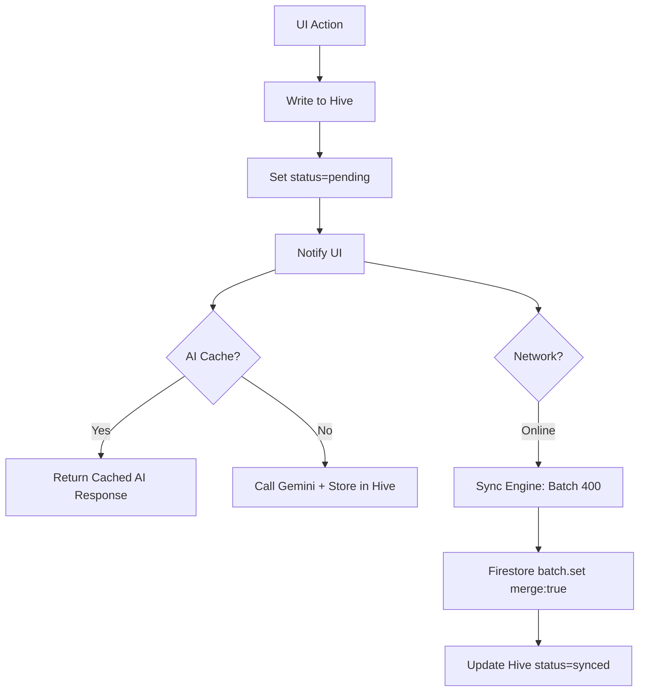

# Design Document: Hive-First Sync Engine & Cost Optimization (P0)

## Overview
This document outlines the architecture for transitioning CSMS to an offline-first system and implementing aggressive cost optimizations to survive the Firebase Spark plan limits.

## Problem Analysis
- **Network Dependency:** UI hangs on unstable WiFi; solved by **Hive-First Write-Behind**.
- **Quota Killers (Red Alert):** 
    - `_writeMark` reads Firestore twice per mark (30 marks = 60 reads).
    - Duplicate `collectionGroup` queries for student history.
    - Unbounded streams (`watchSessions`) downloading entire histories.
- **AI Waste:** Gemini calls with no data context and no response caching.

## Proposed Design

### 1. Unified Sync Architecture (Write-Behind)
- **Single Source of Truth:** Hive handles all UI updates.
- **Metadata:** All P0 models track `syncStatus` and `updatedAt`.
- **Deterministic IDs:** Idempotent writes via client-generated keys.

### 2. Quota & Cost Optimizations
- **Stream Bounding:** Apply `.limit(50)` to all real-time session/student streams.
- **Query Consolidation:** `getStudentAttendanceStats` will delegate to `getStudentAttendanceHistory` to eliminate redundant `collectionGroup` scans.
- **Validation Caching:** Repositories will accept a `cachedSession` or `PermissionToken` to avoid re-reading Firestore on every mark.
- **AI Caching:** Use a dedicated Hive box (`ai_response_cache`) with a 1-hour TTL to prevent redundant Gemini API calls.
- **Field Projection:** Use `.get(GetOptions(source: Source.cache))` or specific field selection to reduce bytes.

### 3. Client-Side Admin Logic
- **Servant Archiving:** Update `isActive` flag in `/servants/{uid}` directly from the client.

## Diagram: Cost-Optimized Sync

