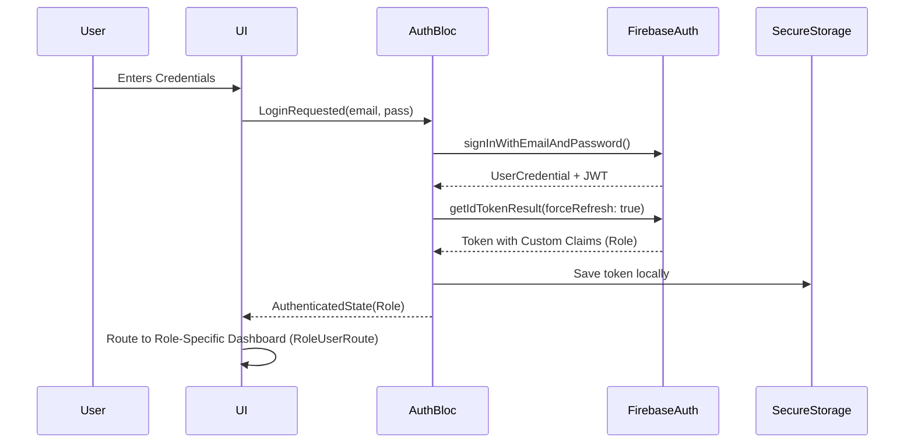
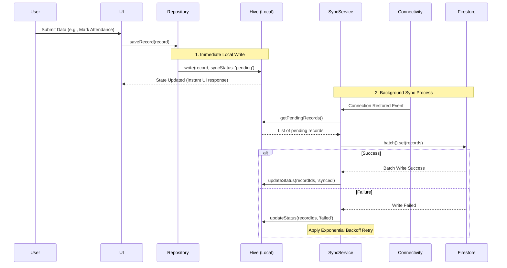
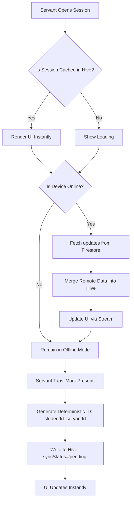
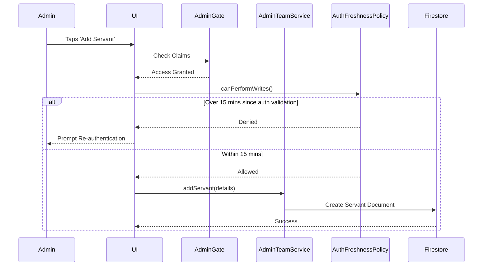

# CSMS - Detailed Operations Graph

This document provides a detailed breakdown of the core operations within the CSMS app, visualized using Mermaid graphs.

## 1. Authentication & RBAC Flow

## 2. Offline-First Write & Sync Flow (The Sync Engine)

## 3. Attendance Operation Flow

## 4. Admin Operation Flow (e.g., Add New Servant)

## Summary of Data Models

- **Servants**: Central profile including roles (`admin`, `servant`, `teacher`, `viewer`), tied to Firebase Auth UID.
- **AttendanceSessions**: Represents a specific service/class occurrence.
- **AttendanceRecords**: The junction record linking a `session`, a `student`, and the marking `servant`. Uses deterministic IDs to prevent duplicate entries during offline sync resolution.
